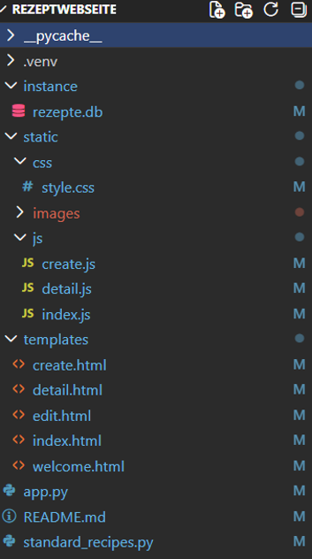

# Rezept-Webseite

## Projektbeschreibung

Dieses Projekt ist eine Rezept-Webseite, die im Rahmen des Basislehrjahres entwickelt wurde.
Benutzer können Rezepte ansehen, erstellen, bearbeiten und löschen. Zusätzlich gibt es Funktionen wie Suche, Kategorien, Bewertungen, Favoriten und einen Portionsrechner.

Ziel des Projekts ist es, eine praktische und persönliche Anwendung zu erstellen, die Kochen und Programmieren verbindet.

Hinweis: Alle in diesem Projekt verwendeten Rezeptbilder wurden von mir persönlich erstellt und nicht aus dem Internet oder von externen Quellen übernommen.

---

## Funktionen

### Pflichtfunktionen

- Rezepte anzeigen (Übersicht + Detailseite)
- Eigene Rezepte erstellen, bearbeiten und löschen
- Kategorien (z. B. Frühstück, Hauptgericht, Dessert)
- Suchfunktion (nach Name oder Zutat)
- Portionsrechner zur Anpassung der Zutaten
- Bilder zu Rezepten hinzufügen
- Favoriten speichern
- Bewertung mit 1–5 Sternen

### Erweiterungen (geplant)

- Benutzer-Login
- Kommentare zu Rezepten
- Rezepte bewerten & melden
- Bilder in Kommentaren hochladen
- Webseite online bereitstellen (Deployment)

---

## Technologien

### Frontend

- HTML
- CSS
- JavaScript

### Backend

- Python
- Flask (Web-Framework)

### Datenbank

- SQLite
- SQLAlchemy (ORM für Datenbankzugriff)

---

## Projektstruktur

---

## Features im Detail

- **Portionsrechner:** passt Zutaten automatisch an die gewünschte Personenanzahl an
- **Bewertungssystem:** Rezepte können mit 1–5 Sternen bewertet werden
- **Favoriten:** Lieblingsrezepte können gespeichert werden
- **Suchfunktion:** schnelle Suche nach Rezeptnamen oder Zutaten
- **CRUD-Funktionen:** Rezepte erstellen, bearbeiten und löschen

---

## Autorin

Teodora Stokic
Applikationsentwicklerin im 1. Lehrjahr
Klasse: AP25c
